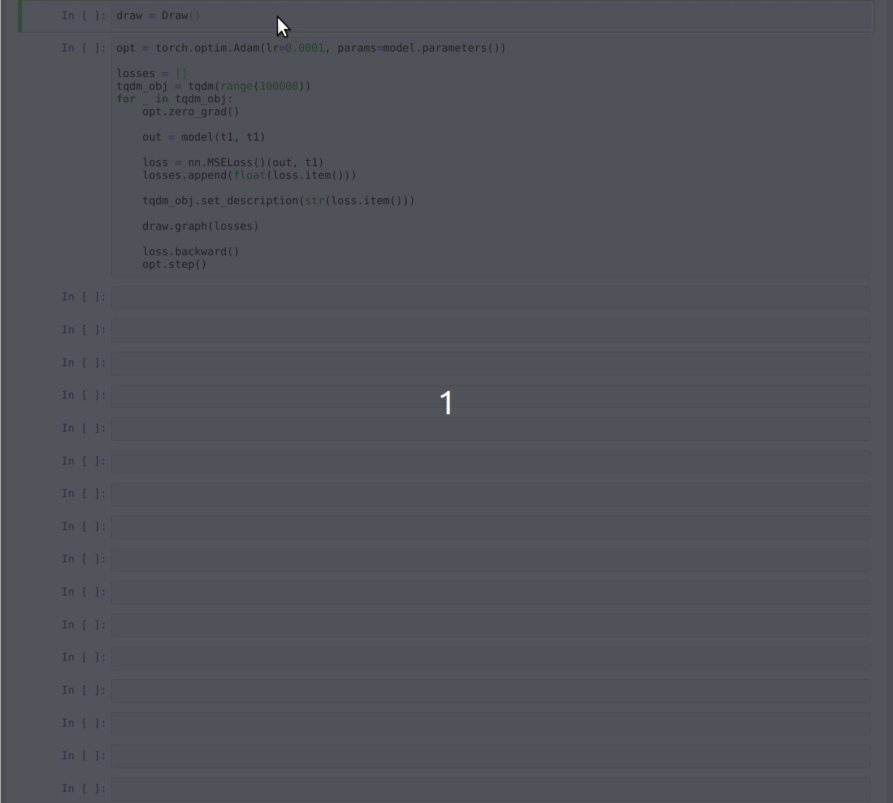

# jupyter-live-graph

Let's you do this:



As simple as:

```
from draw import Draw

draw = Draw()
for i in range(1000):
  draw.graph([j for j in range(i)])
```

## License

MIT

## Contributing

This project is wide open to pull requests.
